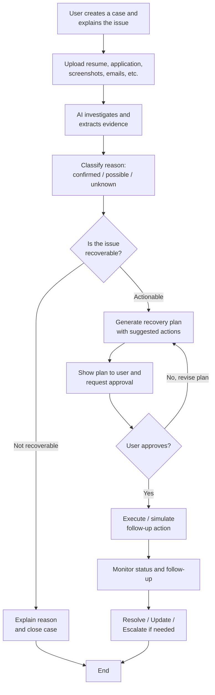
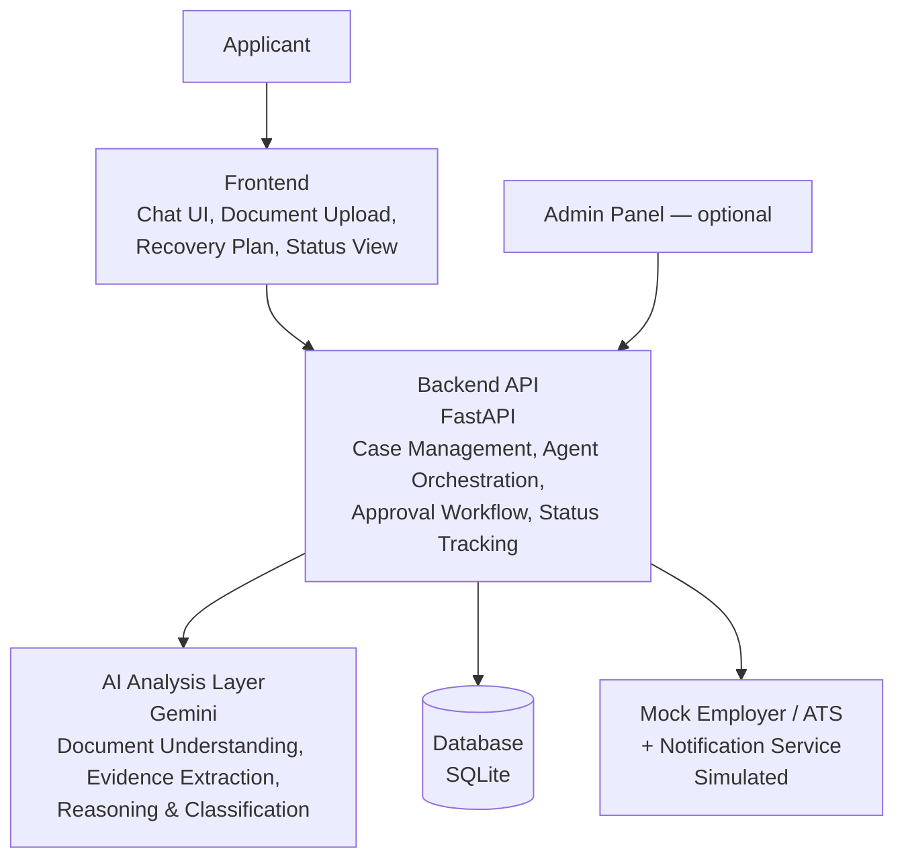

[README.md](https://github.com/user-attachments/files/32621965/README.md)
<div align="center">

# WorkRecover AI

### Work Application Recovery Agent

> An agentic case-recovery system for job and internship applicants dealing with silence, unexplained rejection, or missed action requests from employers.


</div>

---

## Overview

Job and internship applicants often encounter silence, unexplained rejection, or requests for action that they miss or misunderstand. Existing platforms primarily focus on job discovery and application tracking, leaving applicants with limited guidance when something goes wrong - they are often left guessing what happened and what they can legitimately do next.

**WorkRecover AI** focuses on this gap. Instead of another job-discovery or application-tracking tool, it reconstructs the applicant's case from the evidence they already have, distinguishes fact from inference, determines whether a legitimate recovery path exists, and prepares the next action — with the applicant's explicit approval.

| | |
|---|---|
| **Existing tools** | *"Which jobs can I apply to, and what's my application status?"* |
| **WorkRecover AI** | *"My application went silent / was rejected / needs a correction. What actually happened, what evidence supports that, and what can I legitimately do next?"* |

---

## Problem

Silence and ambiguity after applying are common, not exceptional:

- Suvvale's 2025 Candidate Experience Benchmark found that a majority of candidates received no feedback after being rejected during screening or interviewing.
- A 2025 Stepstone survey of over 8,000 respondents in Germany found that most jobseekers reported being ghosted by companies, with a substantial share experiencing it after submitting application documents.

Existing platforms primarily provide job discovery and status tracking, not guidance on **what to do once something has gone wrong.** Applicants are left without a clear way to know:

- Why an application was rejected, delayed, or went silent
- Which document or piece of information may have caused the issue
- Whether their available evidence is sufficient to act on
- What action, if any, can legitimately be taken next
- Whether the case is actually resolved or genuinely closed

---

## Proposed Solution

The user provides the job description, resume, application confirmation, and any relevant employer communication. The agent then:

- Separates findings into **confirmed**, **possible**, and **unknown**, so assumptions are never presented as facts.
- Classifies the case as **recoverable**, **actionable but uncertain**, or **closed**.
- Builds a recovery plan and drafts appropriate follow-up messages or application corrections.
- Requires explicit user approval before any consequential action.
- Monitors application events and employer responses, and updates the recovery plan accordingly.
- Maintains a persistent case record so the user can return without restarting the investigation.

The agent never guarantees that a rejection can be reversed. Its goal is to identify legitimate next actions — or to clearly close the case when no recovery path exists.

---

## Target Users & Impact

The primary users are **students, fresh graduates, and early-career applicants** who often have limited access to experienced career guidance or recruiter networks. WorkRecover AI helps them understand what is known, what is uncertain, and what action they can take next.

The same case-recovery approach can later extend to gig work, apprenticeships, and public employment workflows.

---

## Core Workflow



---

## Evidence and Case Classification

The system never presents an AI inference as an established fact or a guaranteed outcome.

**Evidence labels**

| Label | Meaning |
|---|---|
| **Confirmed** | Directly supported by uploaded evidence or verified employer communication |
| **Possible** | A plausible explanation inferred by the AI, not yet confirmed |
| **Unknown** | Information that cannot currently be established |

**Case classification**

| Status | Meaning |
|---|---|
| **Recoverable** | A legitimate next action exists and can be proposed |
| **Actionable but uncertain** | A possible action exists, but confidence is limited |
| **Closed** | No legitimate recovery path is available |

---

## Technology Stack

| Layer | Technology |
|---|---|
| AI / Reasoning | Gemini API — evidence extraction, confirmed vs. inferred reasoning, recoverability classification, drafting |
| Backend | Python + FastAPI |
| Database | SQLite (case state and history) |
| Mock Employer Integration | FastAPI endpoints simulating submissions, status changes, and employer responses |
| Frontend | React + TypeScript — evidence panel, agent activity view, recovery plan, approval flow, timeline |
| Document Handling | PDF text extraction for resumes, job descriptions, and employer notices |

---

## System Architecture



External employer/ATS interactions are **mocked and simulated** in the current prototype; there is no real integration with any employer system.

> The proposal's design diagrams (use case, activity, sequence, and component views) also describe a longer-term target architecture — including PostgreSQL/MongoDB and a Node.js option for the backend. The current hackathon build uses the stack listed above; the diagrams represent design intent, not implemented infrastructure.

---

## Prototype Scope

- MVP scenario: recovery of a **software internship application**
- Synthetic or demonstration data
- Mock/simulated employer and ATS interactions
- Human approval required before any consequential recovery action
- Optional admin panel for monitoring the system

> The prototype does not claim real-time or production access to any employer or ATS system.

---

## What This Is Not

WorkRecover AI is **not**:

- A job discovery or job-board platform
- A generic application tracker
- A guarantee that a rejection can be reversed
- An autonomous system that submits or negotiates on the user's behalf without approval
- A replacement for an employer's or ATS's own communication channels
- A universal solution for every hiring process or industry

The prototype demonstrates the **case-recovery layer** that sits after something has already gone wrong with an application.

---

## Repository Structure

```text
worker-application-recovery-agent/
├── app/                  # Next.js application routes
├── components/           # Reusable frontend components
├── lib/                  # Shared utilities and application logic
├── public/               # Static assets
├── package.json
├── package-lock.json
├── next.config.ts
├── next-env.d.ts
├── postcss.config.mjs
├── tsconfig.json
└── README.md
```

> The repository structure may evolve as the frontend, backend, and agent components are integrated.

---

## Development

### Prerequisites

- Node.js
- npm
- Git

### Install dependencies

```bash
npm install
```

### Start the development server

```bash
npm run dev
```

Then open the local development URL shown by Next.js.

### Build for production

```bash
npm run build
```

---

## Design Principles

1. **Recovery over discovery** - Focus on recovering problematic applications rather than helping users find new ones.
2. **Evidence before inference** - Clearly separate confirmed evidence from AI-generated inference.
3. **Human-in-the-loop** - The applicant reviews and approves every consequential action.
4. **Honest classification** - A case is only ever called recoverable, actionable but uncertain, or closed — never guaranteed.
5. **Transparent uncertainty** - Unknown information stays unknown rather than being fabricated.
6. **Mock interactions are explicit** - Simulated employer/ATS integrations are clearly labeled as such.

---

## Prototype Status

**Status:** Hackathon Prototype - *Build for Billions*, Track: **Agentic AI For Billions**

The current implementation demonstrates the core case-recovery workflow and system concept for a single MVP scenario (a software internship application). It is not a production integration with any employer, ATS, or job platform.

---

## Team

**Team Name:** MaxXCode
**Team Leader:** M. Mayank Kamath
**College/University:** Mangaluru Institute of Technology and Engineering, Moodbidri

| Member | Contribution |
|---|---|
| Dhruv T. Shetty, Keval R J | **Frontend** - UI and interaction flows, chat interface, evidence upload, recovery plan and status screens, integration with backend APIs |
| M. Mayank Kamath, Abhishek Thotanthillaya | **Backend** - APIs and recovery workflows, case management, document handling, database operations, status tracking, frontend integration |
| Siddhi | **Research & System Design** - problem/solution research, user journey, recovery workflow, system architecture, functional requirements |
| Disha Nayak | **Testing & Documentation** - functional testing, bug identification, project documentation, demo preparation |

---

## License

This project is currently intended for hackathon and demonstration purposes.

*Add a formal license here if the team decides to open-source the project.*
